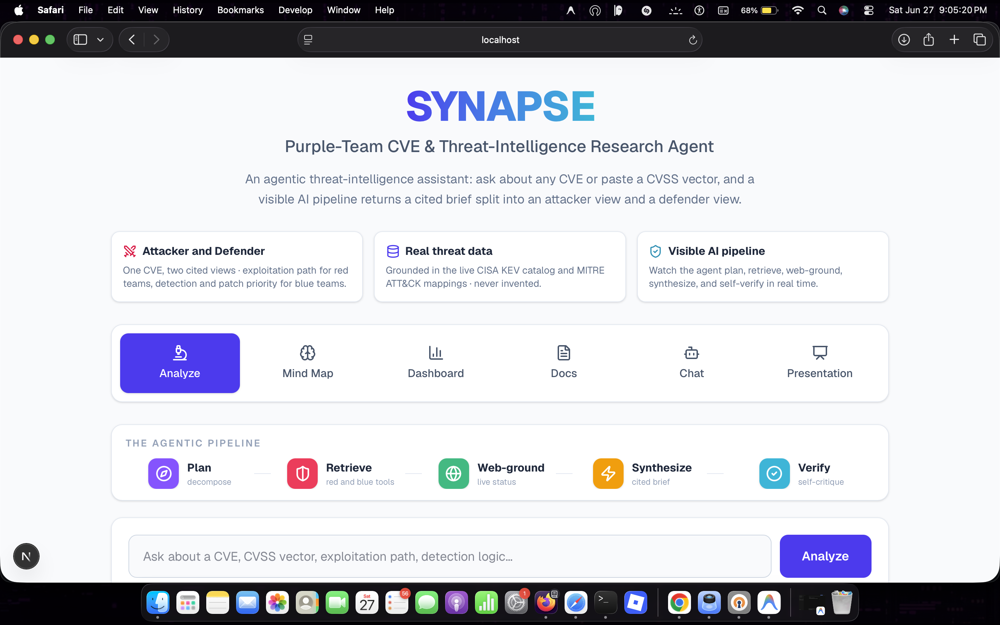

# SYNAPSE — Purple-Team CVE & Threat-Intelligence Research Agent

**SYNAPSE turns a single CVE or threat question into an analyst-ready brief — split into an
Attacker view (red) and a Defender view (blue) — through a visible, multi-stage AI agent pipeline,
grounded in real CISA KEV and MITRE ATT&CK data instead of the model's imagination.**

Built for the GeeksforGeeks × Google **Build with AI (UAE)** workshop with **Google Antigravity**,
the **Gemini API**, and **Next.js**.



---

## The problem

When a new CVE drops, analysts scramble across NVD, vendor advisories, CISA KEV, MITRE ATT&CK, and
scattered PoCs — and they ask the **same vulnerability two different ways**:

- **Red teams** want: the exploitation path, public PoC availability, blast radius, and which ATT&CK
  techniques it enables.
- **Blue teams** want: is it exploited in the wild, what's the patch priority, what do we hunt for,
  and what mitigates it.

It's one CVE, answered twice, slowly, in separate silos.

## What SYNAPSE does

One question in. A **cited, dual-perspective brief** out:

- **Attacker view (red):** exploitation path, PoC status, blast radius, mapped MITRE ATT&CK techniques.
- **Defender view (blue):** exploited-in-the-wild status, deterministic patch priority (P0/P1/P3),
  detection guidance, threat-hunt queries, and mitigating controls.

Every fact is grounded in real tools and data — the language model **orchestrates**, the code
**computes**. CVSS scores, KEV status, and ATT&CK mappings are never invented.

## The agentic pipeline (visible in real time)

```
Plan  ->  Retrieve (red + blue tools)  ->  Web-ground  ->  Synthesize  ->  Verify
```

1. **Plan** — decompose the analyst question; extract CVE IDs and CVSS vectors.
2. **Retrieve** — run deterministic red/blue tools against real data.
3. **Web-ground** — pull live exploit / PoC / patch status via Google Search grounding.
4. **Synthesize** — compose the cited red/blue brief.
5. **Verify** — a self-critique pass checks every claim against its evidence.

Each stage streams to the UI as it runs, so the agent's reasoning is never a black box.

## Features

| Module | What it does |
|--------|--------------|
| **Analyze** | The visible agent pipeline + the red/blue cited brief, ending in a self-critique pass. |
| **Mind Map** | A NotebookLM-style interactive canvas that explores a CVE as a connected graph (severity, weaknesses, ATT&CK, defenses). |
| **Dashboard** | Live charts over 1,600+ real CISA KEV entries — top affected vendors, weakness-class (CWE) distribution, and additions over time. |
| **Docs** | Upload an advisory, pentest report, or threat PDF; Gemini reads it natively to extract findings, IOCs, and map TTPs to ATT&CK. |
| **Chat** | A conversational, tool-augmented assistant for quick CVE / CVSS / detection questions. |
| **Presentation** | Auto-generates a threat-brief slide deck from a CVE's real findings. |

## The tools (the agentic core)

| Tool | Lane | Purpose |
|------|------|---------|
| `cvss_lookup` | red | Exact CVSS v3.1 base score and severity band from a vector string |
| `kev_check` | blue | CISA KEV lookup -> exploited-in-the-wild status + deterministic patch priority |
| `map_detections` | blue | Weakness class (CWE) -> ATT&CK techniques, threat-hunt queries, and mitigations |
| `web_ground` | both | Live exploit / PoC / patch status via Google Search grounding |

These run as real code, so their outputs are exact and reproducible — the model can't hallucinate a
CVSS score or fake an "exploited in the wild" flag.

## Tech stack

- **Framework:** Next.js (App Router) + TypeScript, streamed responses over Node route handlers
- **AI:** Gemini 2.5 Flash (workhorse) and Flash-Lite (lightweight stages) via the `@google/genai`
  SDK — structured JSON output, function calling, Google Search grounding, native PDF understanding
- **UI:** Tailwind CSS, lucide-react icons, Recharts (dashboard), @xyflow/react (mind-map canvas)
- **Data:** CISA Known Exploited Vulnerabilities catalog + MITRE ATT&CK technique mappings
- **Deploy:** Vercel

## Data sources

- **CISA KEV** — the authoritative catalog of vulnerabilities known to be exploited in the wild.
- **MITRE ATT&CK** — adversary techniques mapped to weakness classes for detection and mitigation.

---

Built with **Google Antigravity** + **Gemini API** + **Next.js**.

`#Googleantigravity` `#BuildwithAI` `#BwAIUAE`
